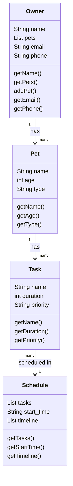

# PawPal+ Project Reflection

## 1. System Design

**a. Initial design**

- Briefly describe your initial UML design.
a. Add a pet 
b. Add or edit tasks 
c. Generate daily schedule

- What classes did you include, and what responsibilities did you assign to each?
The classes that I included are:

Owner — stores owner info (name, etc.)
Pet - holds pet info
Task - stores what needs to be done
Schedule - stores the timeline/schedule for thr task to be done

Classes and their descriptions: 

a. Owner Class stores the owner's name, email, phone and  its pets.

b. Pet Class stores the pet's name, age, type and it contains the list of tasks.

c. Task Class stores the name of the tasks, duration and priorities of a care activity that belongs to a pet.

d. Schedule stores the startTime, and organizes the tasks into a timeline showing when each task should be done.  

**b. Design changes**

- Did your design change during implementation?
Yes, the design changed.

- If yes, describe at least one change and why you made it.
Initially Schedule had a generic list of tasks with no connection to a specific pet. After review, we added a link between Pet and Schedule so that when a schedule is generated, it knows which pet it belongs to and can pull that pet's tasks directly.
---

## 2. Scheduling Logic and Tradeoffs

**a. Constraints and priorities**

- What constraints does your scheduler consider (for example: time, priority, preferences)?
- How did you decide which constraints mattered most?

**b. Tradeoffs**

- Describe one tradeoff your scheduler makes.
- Why is that tradeoff reasonable for this scenario?

---

## 3. AI Collaboration

**a. How you used AI**

- How did you use AI tools during this project (for example: design brainstorming, debugging, refactoring)?
- What kinds of prompts or questions were most helpful?

**b. Judgment and verification**

- Describe one moment where you did not accept an AI suggestion as-is.
- How did you evaluate or verify what the AI suggested?

---

## 4. Testing and Verification

**a. What you tested**

- What behaviors did you test?
- Why were these tests important?

**b. Confidence**

- How confident are you that your scheduler works correctly?
- What edge cases would you test next if you had more time?

---

## 5. Reflection

**a. What went well**

- What part of this project are you most satisfied with?

**b. What you would improve**

- If you had another iteration, what would you improve or redesign?

**c. Key takeaway**

- What is one important thing you learned about designing systems or working with AI on this project?
