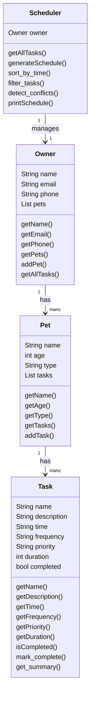

# PawPal+ Project Reflection

## 1. System Design

**a. Initial design**

- Briefly describe your initial UML design.
a. Add a pet 
b. Add or edit tasks 
c. Generate daily schedule

- What classes did you include, and what responsibilities did you assign to each?
The classes that I included are:

Owner — stores owner info (name, etc.)
Pet - holds pet info
Task - stores what needs to be done
Schedule - stores the timeline/schedule for thr task to be done

Classes and their descriptions: 

a. Owner Class stores the owner's name, email, phone and  its pets.

b. Pet Class stores the pet's name, age, type and it contains the list of tasks.

c. Task Class stores the name of the tasks, duration and priorities of a care activity that belongs to a pet.

d. Schedule stores the startTime, and organizes the tasks into a timeline showing when each task should be done.  

**b. Design changes**

- Did your design change during implementation?
Yes, the design changed.

- If yes, describe at least one change and why you made it.
Initially Schedule had a generic list of tasks with no connection to a specific pet. After review, we added a link between Pet and Schedule so that when a schedule is generated, it knows which pet it belongs to and can pull that pet's tasks directly.
---

## 2. Scheduling Logic and Tradeoffs

**a. Constraints and priorities**

- What constraints does your scheduler consider (for example: time, priority, preferences)?
The scheduler considers priority level (high, medium, low), scheduled time (HH:MM), and task frequency (daily, weekly, once). It can also filter by completion status and detect time conflicts.

- How did you decide which constraints mattered most?
Priority was the most important constraint because a pet owner needs to know which tasks are critical (e.g. medication) vs. optional (e.g. playtime). Time sorting was added second to make the schedule readable in a real-world order.

**b. Tradeoffs**

- Describe one tradeoff your scheduler makes.
The conflict detection only flags tasks that share an exact `HH:MM` start time. It does not check whether a 30-minute task overlaps with a task starting 15 minutes later.

- Why is that tradeoff reasonable for this scenario?
For a simple pet care planner, exact-time conflicts are the most common and most obvious problem to catch. Detecting overlapping durations would require tracking end times for every task, adding complexity that isn't needed at this stage.

---

## 3. AI Collaboration

**a. How you used AI**

- How did you use AI tools during this project (for example: design brainstorming, debugging, refactoring)?
AI was used throughout: generating class stubs from the UML design, implementing sorting and filtering logic, writing the test suite, and updating the Streamlit UI to surface the new features. It was also used to add docstrings and draft commit messages.

- What kinds of prompts or questions were most helpful?
Specific, scoped prompts worked best — e.g. "add a sort_by_time method to Scheduler that sorts by HH:MM using a lambda" rather than vague requests like "make the scheduler smarter." Asking AI to explain code before saving it also helped build understanding.

**b. Judgment and verification**

- Describe one moment where you did not accept an AI suggestion as-is.
When implementing recurring tasks, an early suggestion used date strings instead of `timedelta`, which would have broken if the time crossed midnight. The `timedelta` approach was chosen instead as it is more accurate and Pythonic.

- How did you evaluate or verify what the AI suggested?
Every suggestion was verified by running the code and checking the output in `main.py`, then confirmed by automated tests in `tests/test_pawpal.py`. If a test failed, the logic was re-examined before accepting the fix.

**c. AI Strategy — VS Code Copilot**

- Which Copilot features were most effective for building your scheduler?
Inline Chat was most useful for implementing specific methods (like `sort_by_time` and `detect_conflicts`) directly in context. Generate Tests saved significant time drafting the initial test structure, which was then reviewed and refined.

- Give one example of an AI suggestion you rejected or modified to keep your system design clean.
Copilot initially suggested adding conflict detection directly inside `generateSchedule()`, which would have mixed concerns. The decision was made to keep it as a separate `detect_conflicts()` method so the UI could call it independently and display warnings before showing the schedule.

- How did using separate chat sessions for different phases help you stay organized?
Keeping algorithmic planning separate from core implementation prevented earlier design decisions from influencing new logic in unexpected ways. Each phase had a focused context, making it easier to evaluate suggestions without drift from prior conversations.

---

## 4. Testing and Verification

**a. What you tested**

- What behaviors did you test?
Sorting correctness (tasks return in chronological order), recurrence (daily/weekly tasks create a new instance on completion), conflict detection (same-time tasks trigger a warning), filtering by pet name and completion status, and edge cases (no tasks, non-recurring tasks, no conflicts).

- Why were these tests important?
These are the core behaviors a pet owner depends on. If sorting is wrong, the schedule is misleading. If recurrence fails, daily tasks disappear after one completion. Conflict detection prevents overlapping appointments that would confuse the owner.

**b. Confidence**

- How confident are you that your scheduler works correctly?
Very confident — 12/12 tests pass, covering both happy paths and edge cases. The automated suite makes it easy to catch regressions if the logic changes.

- What edge cases would you test next if you had more time?
Tasks that overlap in duration (not just exact start time), an owner with multiple pets having the same task name, and very large task lists to check sorting performance.

---

## 5. Reflection

**a. What went well**

- What part of this project are you most satisfied with?
The algorithmic layer — sorting, filtering, conflict detection, and recurrence all work together cleanly and are each independently testable. The separation of concerns between `pawpal_system.py` (logic) and `app.py` (UI) made the system easy to extend without breaking existing features.

**b. What you would improve**

- If you had another iteration, what would you improve or redesign?
The conflict detection would be upgraded to check overlapping durations, not just exact start times. The UI would also allow editing and deleting individual tasks, and support multiple pets in the session.

**c. Key takeaway**

- What is one important thing you learned about designing systems or working with AI on this project?
AI is a powerful accelerator, but the human architect still controls quality. AI generates working code quickly, but without clear design decisions (like keeping `detect_conflicts` separate from `generateSchedule`), the system becomes tangled. The most valuable skill is knowing *when* to accept a suggestion and *when* to push back.
